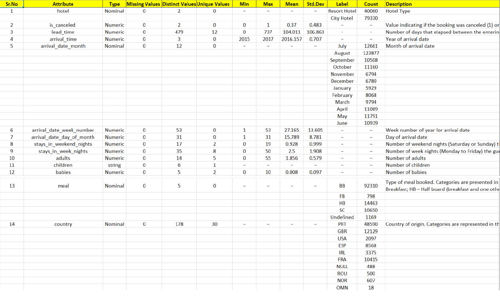
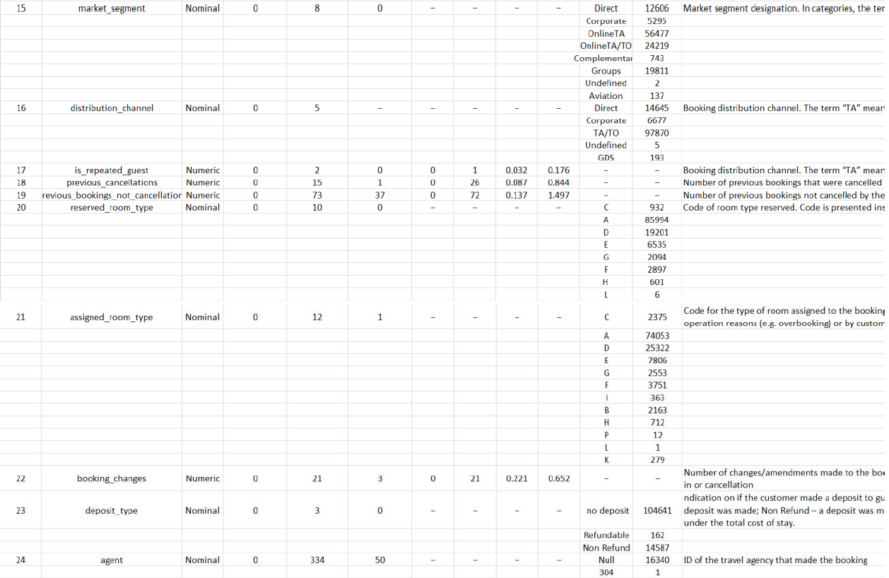
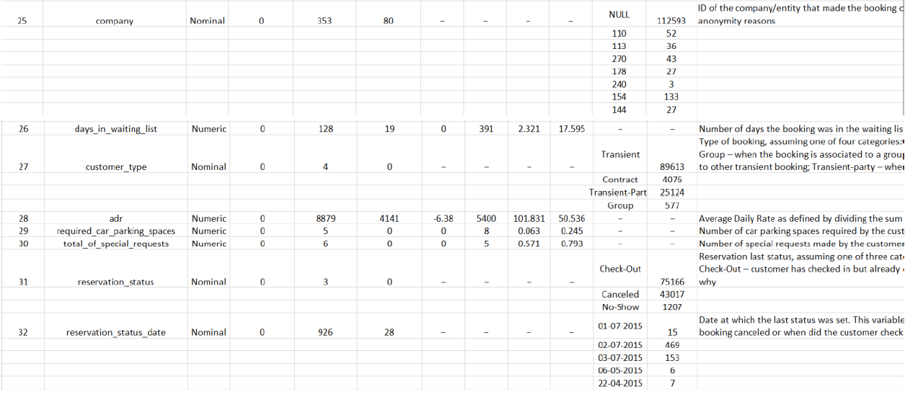
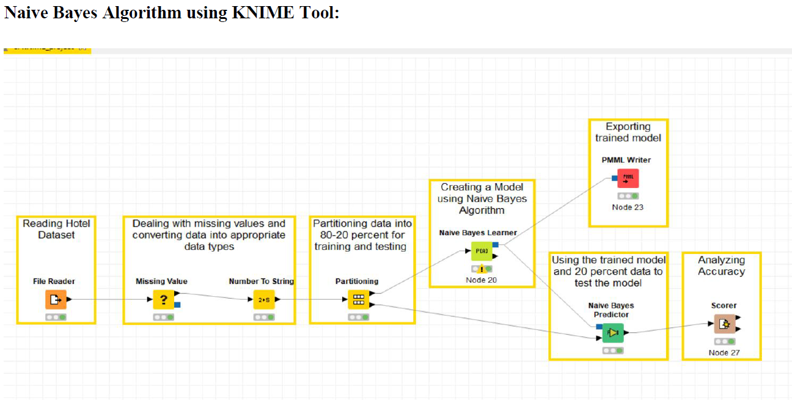
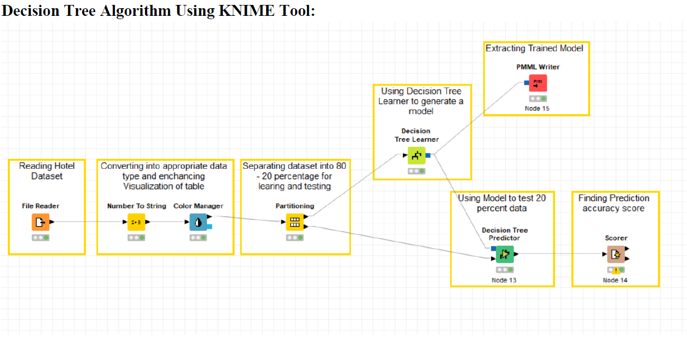
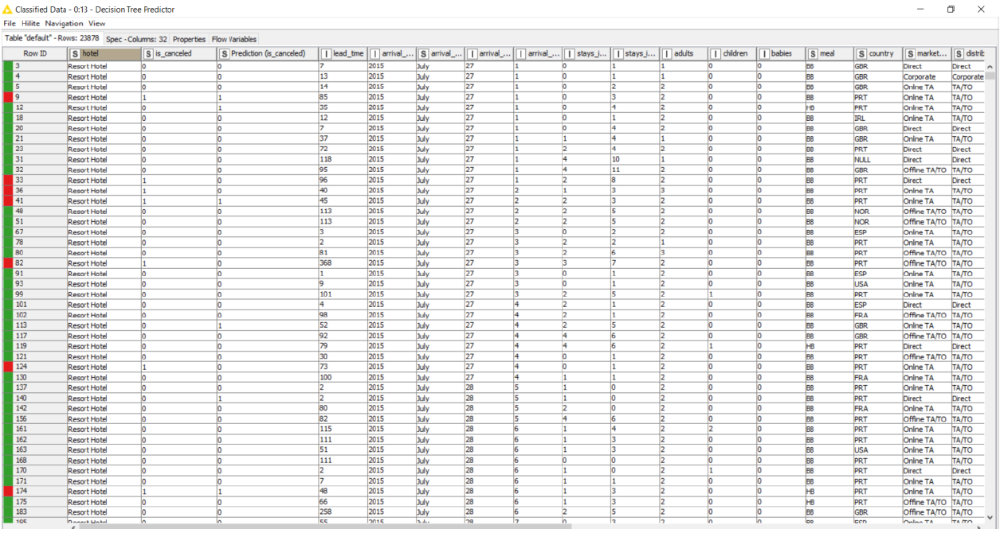
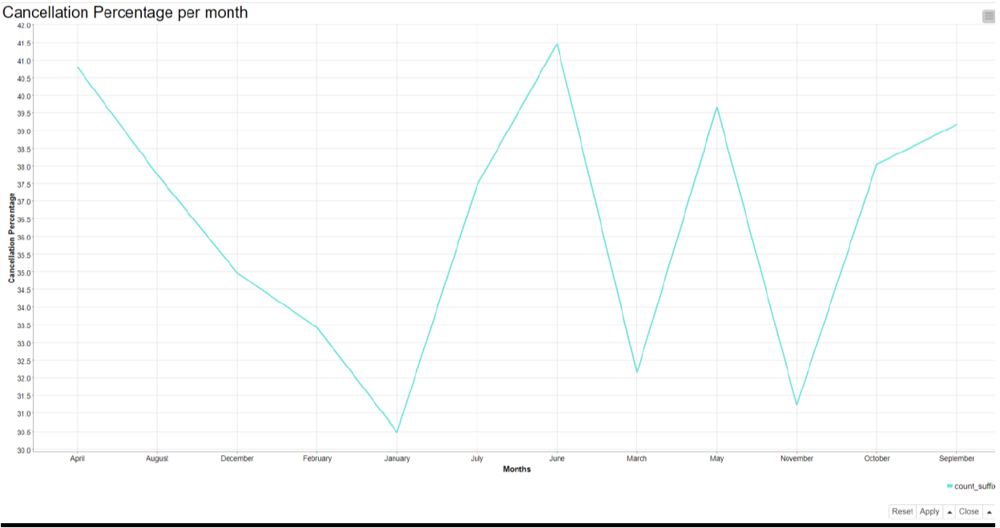
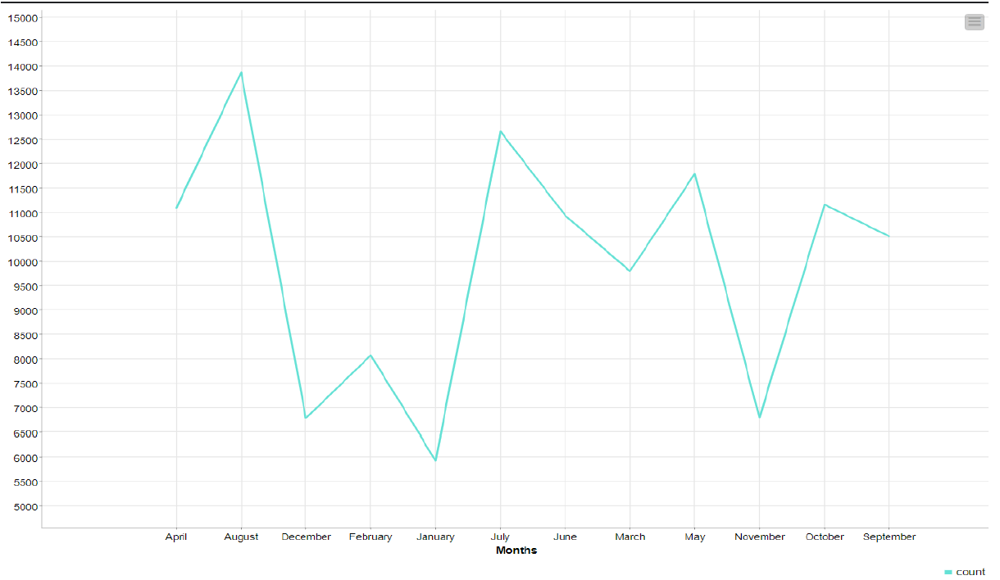
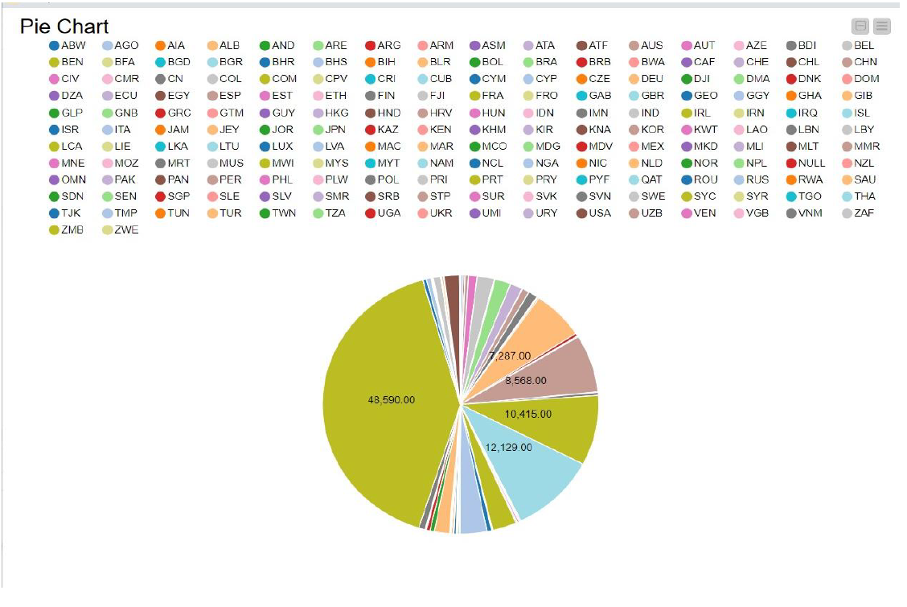
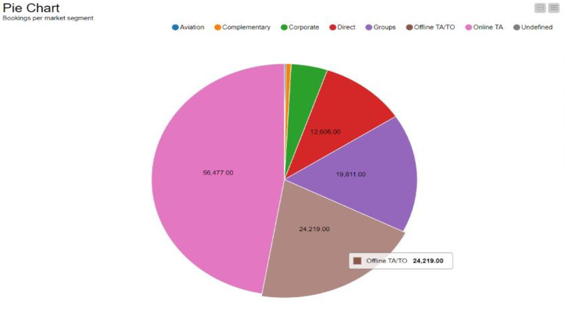

# Prediction-of-Cancellations-of-Hotel-Bookings-analyzing-Customer-Traffic-using-Business-Intelligence
Prediction if a person is going to cancel the hotel reservation he/she made. Dataset of hotel reservations with 1,19,390 records of customers with information such as reservation date, deposit type, number of adults, number of children, meal types, room type (in class) etc. Data cleaning and transformation was performed to remove the missing and null values and also to remove an unwanted column from the dataset. EDA was also performed to gain the maximum knowledge from the dataset. Used a tool, KNIME which is helpful for using algorithms, creating models and deploying the model to work for predicting cancellation of new reservations. We use two different algorithms namely Decision Tree Algorithm and Naive Bayes Algorithm. Comparing both of the algorithms we experienced better accuracy in the Decision Tree Algorithm. We received an accuracy of 83%.

Dataset: https://www.kaggle.com/jessemostipak/hotel-booking-demand

Data Exploration:

Implementation:

1. Naive Bayes Algorithm using KNIME Tool

2. Decision Tree Algorithm Using KNIME Tool:

3. Prediction on Test Data:  
Comparing both the algorithms, we experience better accuracy in Decision Tree Algorithm. This also makes sense in general as Decision Tree analyzes all other fields including desposits, data, etc and predicts on the basis of these fields which is suitable for situations like in a Hotel

This table shows "Predicted_is_canceled" and "is_canceled". Comparing these two columns we get an accuracy of 83% using the Decision Tree algorithm.

4. Following visualizations were made:  
  a. Cancellation Percentage per month 
    
  
  b. Average number of guests in an entire year  
  By this the hotel can send out more add campaigns to attract more customers during these months or can also conduct renovation work thereby not disturbing too many guests
    
  
  c. Customers coming from which part of the world  
  This can help the hotel do more publicity and promotional events in those countries to attract more customers
    
  
  d. Reservations coming from which Market Segment
  The hotel can then decide which from which market segment more number of customers are coming in and thereby decide their further strategies.
    
